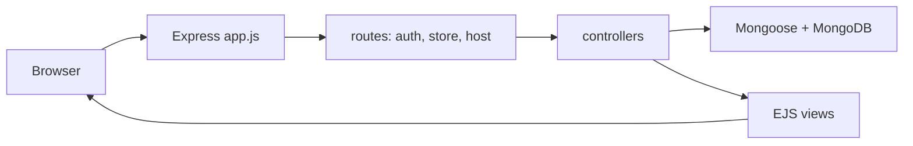

# Airbnb-style listings

A full-stack style **Node.js** demo app modeled after short-term rental browsing: server-rendered pages with **EJS**, data in **MongoDB** via **Mongoose**, **cookie-based sessions** persisted in MongoDB, and **Tailwind CSS** for styling. Users can sign up as **guest** or **host**, browse and favourite listings, and (when logged in) use host tools to create, edit, and delete homes with image uploads.

This README describes how the project is structured, how data flows through it, and how to run it locally.

---

## Table of contents

1. [What the app does](#what-the-app-does)
2. [Architecture](#architecture)
3. [Tech stack](#tech-stack)
4. [Project structure](#project-structure)
5. [Data models](#data-models)
6. [HTTP routes and behaviour](#http-routes-and-behaviour)
7. [Authentication and sessions](#authentication-and-sessions)
8. [File uploads (Multer)](#file-uploads-multer)
9. [Validation (signup)](#validation-signup)
10. [Prerequisites and setup](#prerequisites-and-setup)
11. [Running the app](#running-the-app)
12. [Security and production notes](#security-and-production-notes)
13. [Current limitations](#current-limitations)
14. [License](#license)

---

## What the app does

- **Public browsing:** Home page and a full list of registered homes; each home has a detail page.
- **Accounts:** Registration with role selection (`guest` or `host`), login with password check, logout.
- **Favourites:** Logged-in users can add/remove home IDs on their user document; a page lists populated favourite homes.
- **Bookings:** A **bookings** view exists for navigation consistency; there is no separate booking model or payment flow in this codebase.
- **Host area:** All routes under `/host` require an active session. Hosts can add a home (with required photo), list all homes in the database, edit a home (optional new photo removes the old file from disk), and delete a home.

---

## Architecture

High-level request flow:



- **Entry point:** `app.js` wires middleware, mounts routers, connects Mongoose, and listens on **port 3003**.
- **Rendering:** `app.set('view engine', 'ejs')` and views live under `views/`.
- **Static assets:** `public/` (including Tailwind output `public/output.css`) and `uploads/` are exposed as static routes.

---

## Tech stack

| Layer | Technology |
|--------|------------|
| Runtime | Node.js |
| HTTP | Express 4 |
| Templates | EJS |
| Database | MongoDB (Mongoose 8) |
| Sessions | `express-session` + `connect-mongodb-session` (sessions collection) |
| Passwords | `bcryptjs` (hashing with cost factor **12** on signup) |
| Forms / validation | `express-validator` (signup pipeline) |
| Uploads | `multer` (disk storage under `uploads/`) |
| CSS | Tailwind 3 (CLI: `views/input.css` → `public/output.css`) |
| Dev reload | `nodemon` (watches `js`, `json`, `ejs`; see `nodemon.json`) |

`package.json` also lists `mysql2`; the running app in this repo uses **MongoDB only** for persistence.

---

## Project structure

```
airbnb/
├── app.js                 # Express app, MongoDB URI, session, multer, route mounting
├── package.json
├── nodemon.json
├── README.md
├── controllers/           # Route handlers
│   ├── authController.js
│   ├── storeController.js
│   ├── hostController.js
│   └── errors.js
├── models/                # Mongoose schemas
│   ├── user.js
│   └── home.js
├── routes/
│   ├── authRouter.js
│   ├── storeRouter.js
│   └── hostRouter.js
├── utils/
│   └── pathUtil.js        # Root path helper for static dirs
├── views/                 # EJS templates + Tailwind source
│   ├── input.css
│   ├── partials/
│   ├── auth/
│   ├── store/
│   ├── host/
│   └── 404.ejs
├── public/                # Served static files (e.g. compiled CSS)
└── uploads/               # Listing images (create if missing; not always in repo)
```

---

## Data models

### User (`models/user.js`)

| Field | Type | Notes |
|--------|------|--------|
| `firstName` | String | Required |
| `lastName` | String | Optional |
| `email` | String | Required, unique |
| `password` | String | Required; stored **hashed** after signup |
| `userType` | String | `guest` or `host` (default `guest`) |
| `favourites` | ObjectId[] | References `Home` |

### Home (`models/home.js`)

| Field | Type | Notes |
|--------|------|--------|
| `houseName` | String | Required |
| `price` | Number | Required |
| `location` | String | Required |
| `rating` | Number | Required |
| `photo` | String | File path on disk after upload |
| `description` | String | Optional |

There is a commented-out Mongoose `pre` hook on delete for cleaning related data; it is not active. Deleting a home does not automatically remove that home from users’ `favourites` arrays.

---

## HTTP routes and behaviour

### Auth (`routes/authRouter.js`)

| Method | Path | Purpose |
|--------|------|---------|
| GET | `/login` | Login form |
| POST | `/login` | Validates user exists and password; sets session |
| GET | `/signup` | Signup form |
| POST | `/signup` | Validators + create user, redirect to login |
| POST | `/logout` | Destroy session, redirect to login |

### Store (`routes/storeRouter.js`)

| Method | Path | Purpose |
|--------|------|---------|
| GET | `/` | Index: all homes |
| GET | `/homes` | List all homes |
| GET | `/homes/:homeId` | Single home detail |
| GET | `/bookings` | Bookings page (view only) |
| GET | `/favourites` | User’s favourites (uses `req.session.user`) |
| POST | `/favourites` | Add home ID to user favourites (`body.id`) |
| POST | `/favourites/delete/:homeId` | Remove favourite |

### Host (`routes/hostRouter.js`, mounted at `/host`)

Protected by middleware in `app.js`: if not `req.isLoggedIn`, requests are redirected to `/login`.

| Method | Path | Purpose |
|--------|------|---------|
| GET | `/host/add-home` | Form to add a home |
| POST | `/host/add-home` | Create home; **requires** uploaded image |
| GET | `/host/host-home-list` | Lists **all** homes from DB |
| GET | `/host/edit-home/:homeId` | Edit form (`?editing=true` supported) |
| POST | `/host/edit-home` | Update home; new file replaces old image on disk |
| POST | `/host/delete-home/:homeId` | Delete home document |

### Errors

- Unmatched routes fall through to `controllers/errors.js` → **404** EJS page.

---

## Authentication and sessions

- After successful login, `req.session.isLoggedIn = true` and `req.session.user` holds the user document (including `_id`).
- A small middleware sets `req.isLoggedIn` from the session on every request.
- Session data is stored in MongoDB (`connect-mongodb-session`, collection **`sessions`**, same URI as Mongoose).
- Session cookie settings use the defaults from `express-session` as configured in `app.js` (secret is a fixed string in code today).

**Important:** Only routes under `/host` are gated in `app.js`. Favourites handlers assume a logged-in user; using favourites without a session may cause runtime errors. In normal use, log in before using favourites.

---

## File uploads (Multer)

- Configured in `app.js`: **single** field name **`photo`**.
- **Allowed types:** PNG, JPG, JPEG only.
- Files are written under `uploads/` with a random 10-letter prefix plus original filename.
- Static URLs map `uploads` (and aliases) so images can be referenced from templates.

Adding a home without a file returns **422** with plain text `"No image provided"`.

---

## Validation (signup)

`postSignup` uses `express-validator` chains:

- **firstName:** trim, min length 2, letters/spaces only  
- **lastName:** letters/spaces only (optional pattern)  
- **email:** valid email, normalized  
- **password:** min 8 chars, uppercase, lowercase, digit, and one of `!@&`  
- **confirmPassword:** must match password  
- **userType:** must be `guest` or `host`  
- **terms:** must be accepted (`on`)

Failed validation re-renders signup with messages and **old input** (password fields are not echoed back in `oldInput`).

Login uses simple checks (user exists, `bcrypt.compare`); there is no express-validator chain on login in this project.

---

## Prerequisites and setup

1. **Node.js** (LTS recommended).
2. **MongoDB** reachable from your machine (e.g. MongoDB Atlas).
3. **Clone and install:**

   ```bash
   npm install
   ```

4. **Database URI:** In `app.js`, set `DB_PATH` to your MongoDB connection string. It is used for both **Mongoose** and the **session store**. Do not commit real credentials to public repos; prefer environment variables for production.
5. **Upload directory:**

   ```bash
   mkdir -p uploads
   ```

---

## Running the app

```bash
npm start
```

This runs **`nodemon app.js`** in the background **and** **`npm run tailwind`** (Tailwind watch). Nodemon watches `js`, `json`, and `ejs` per `nodemon.json`.

- Application URL: [http://localhost:3003](http://localhost:3003)

Individual scripts from `package.json`:

- `npm run tailwind` — rebuild/watch CSS only  
- `nodemon app.js` — server only (if you run Tailwind separately)

---

## Security and production notes

- **Secrets:** Session secret and database URI are currently **hard-coded** in `app.js`. For any shared or production deployment, move them to environment variables and rotate leaked credentials.
- **HTTPS:** Use HTTPS in production so session cookies are not sent over plain HTTP.
- **Host list:** The host home list shows every `Home` document, not scoped per user; enforcing “my listings only” would require a schema change (e.g. `owner` ref on `Home`) and query updates.
- **Favourites consistency:** If a home is deleted, favourite references may still exist on user documents until cleaned up.

---

## Current limitations

- **Bookings** are not persisted; the route renders a static-style page.
- **No API** layer: everything is form posts and full page renders.
- **No email verification** or password reset flows.
- **Host dashboard** does not filter homes by the logged-in host.

---

## License

ISC — see `package.json`.
